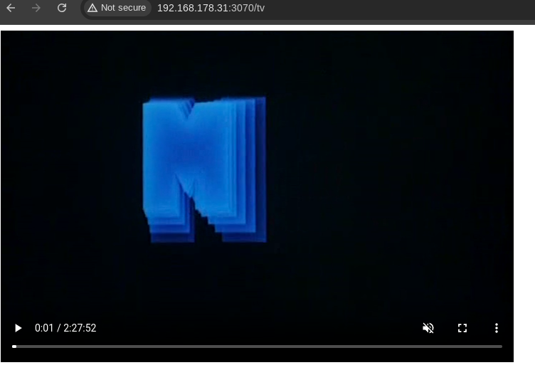

# Random Video Server

Minimalistic mp4 file server from a Kodi-like organized video collection.

## Getting Started

```bash
$ random_video_server -d /location/of/the/folder/with/videos/in/subfolders
```

more options are explained in the help:

```bash
$ random_video_server -h
```

## 127.0.0.1:3070/grid

Shows a grid of posters, fanarts and trailers.
Clicking on a tile plays the mp4.
Trailers are autoplayed and scrolling will load more random titles (JavaScript required...).


## 127.0.0.1:3070/tv

Plays a random video.
When it ends another one starts (JavaScript required...).




## FAQ

- Can't connect from other PC? 
    - Change ip to 0.0.0.0, e.g. `-i 0.0.0.0` or in a `config.toml`.
- How do I get images for the grid? 
    - Export them from Kodi with the "Export to separate files" option or use something like TinyMediaManager.
- How to customize the web interface? 
    - Edit the html/css in src/main.rs.
